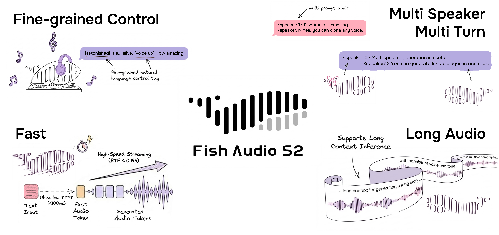
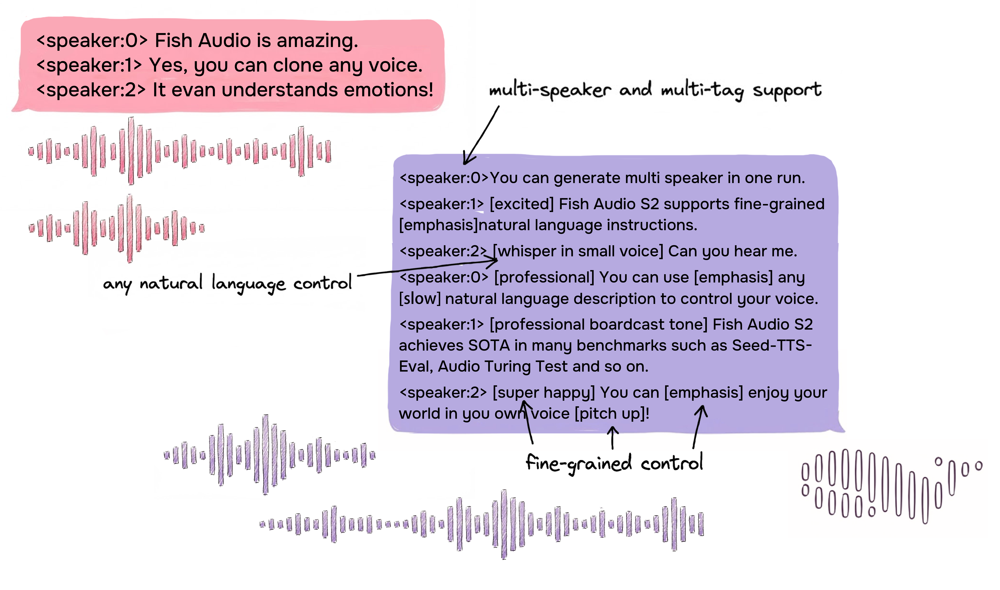

<div align="center">
<h1>Fish Speech — Fork BnB NF4 listo para 12 GB</h1>

[English](../README.md) | **Español** <br>

> **Este es un fork comunitario** de [fishaudio/fish-speech](https://github.com/fishaudio/fish-speech) que añade soporte de **cuantización NF4 de 4 bits con bitsandbytes**, permitiendo inferencia en GPUs con tan solo 12 GB de VRAM.
> Enorme agradecimiento al increíble equipo de [Fish Audio](https://fish.audio/) por crear y liberar el modelo original Fish Speech — todo el crédito por la investigación y la arquitectura es suyo.

<a href="https://www.producthunt.com/products/fish-speech?embed=true&utm_source=badge-top-post-badge&utm_medium=badge&utm_source=badge-fish&#0045;audio&#0045;s1" target="_blank"></a>
<a href="https://trendshift.io/repositories/7014" target="_blank">
    
</a>
<br>
</div>
<br>

<div align="center">
    <a target="_blank" href="https://github.com/groxaxo/fish-speech-int4-patch/stargazers">
        
    </a>
    <a target="_blank" href="https://huggingface.co/groxaxo/s2-pro">
        
    </a>
    <a target="_blank" href="https://github.com/fishaudio/fish-speech">
        
    </a>
</div>

<div align="center">
    <strong>Ejecuta el modelo insignia S2-Pro en tarjetas de 12 GB, descarga el modelo NF4 en Hugging Face, y si esto te ahorra dolores de GPU, dale una estrella al fork.</strong>
</div>

<div align="center">
    <br>
</div>

<br>

<div align="center">
    <a target="_blank" href="https://discord.gg/Es5qTB9BcN">
        
    </a>
    <a target="_blank" href="https://hub.docker.com/r/fishaudio/fish-speech">
        
    </a>
    <a target="_blank" href="https://pd.qq.com/s/bwxia254o">
      
    </a>
</div>

<div align="center">
    <a target="_blank" href="https://huggingface.co/groxaxo/s2-pro">
        
    </a>
    <a target="_blank" href="https://github.com/groxaxo/fish-speech-int4-patch/releases">
        
    </a>
    <a target="_blank" href="https://fish.audio/blog/fish-audio-open-sources-s2/">
        
    </a>
    <a target="_blank" href="https://github.com/fishaudio/fish-speech/blob/main/FishAudioS2TecReport.pdf">
        
    </a>
</div>

> [!IMPORTANT]
> **Aviso de Licencia**
> Este código y los pesos del modelo asociados se publican bajo la **[FISH AUDIO RESEARCH LICENSE](../LICENSE)**. Consulta [LICENSE](../LICENSE) para más detalles. Actuaremos ante cualquier violación de la licencia.

> [!WARNING]
> **Descargo Legal**
> No nos hacemos responsables de ningún uso ilegal del código. Consulta las leyes locales sobre la DMCA y otras leyes relacionadas.

## Despliegue por defecto: S2-Pro en una sola GPU de 12 GB

Este fork está afinado para que **Fish Speech S2-Pro resulte práctico en hardware cotidiano**. La ruta por defecto es ahora un despliegue pulido para **RTX 3060 / 12 GB** con:

- **cuantización NF4 de 4 bits con bitsandbytes** mediante `--bnb4`
- **carga diferida del modelo** para que la API arranque rápido y cargue los pesos en la primera inferencia
- una **API compatible con OpenAI** en `http://0.0.0.0:8880/v1`
- un **frontend Gradio** renovado y ajustado para flujos con audio de referencia
- una **muestra de voz por defecto** incluida, para que las generaciones mantengan una voz consistente aun sin referencia
- un **apagado automático tras 5 minutos** de inactividad para devolver la VRAM cuando el servidor no se usa
- un **instalador de un comando** y un **lanzador de un comando**

La muestra por defecto usa el clip y la transcripción de referencia en español incluidos en el repo. Si quieres otra voz por defecto, reemplaza `sample.mp3` y `sample.lab` por tu par de referencia preferido.

Si quieres la ruta más rápida de clonar a audio, usa esto:

```bash
git clone https://github.com/groxaxo/fish-speech-int4-patch
cd fish-speech-int4-patch

./install_bnb4_3060.sh
./start_bnb4_3060.sh
```

El lanzador usa por defecto:

- `GPU_INDEX=0`
- `PORT=8880`
- `--bnb4 --half`
- `--lazy-load`
- `--idle-timeout-seconds 300`
- `--max-seq-len 4096`

Los puntos de entrada directos siguen ahora los mismos valores por defecto:

- `python tools/api_server.py` arranca en `0.0.0.0:8880` con `--bnb4 --half`
- `python tools/run_webui.py` carga la WebUI con `--bnb4 --half`
- pasa `--no-bnb4` o `--no-half` si necesitas desactivarlos

> [!NOTE]
> `--bnb4` está diseñado para el checkpoint NF4 `s2-pro` alojado por Groxaxo. **No** lo apuntes a directorios de checkpoint `int4` o `int8` antiguos.

### Modelo publicado

- Modelo en Hugging Face: [`groxaxo/s2-pro`](https://huggingface.co/groxaxo/s2-pro)
- Ruta del cargador: mantén `--bnb4 --half` activados al usar este checkpoint
- Ayuda de exportación: `python tools/llama/export_nf4.py --checkpoint-path checkpoints/s2-pro --output-path /tmp/s2-pro-nf4`
- Flujo probado: el `model.pth` NF4 exportado recarga correctamente mediante `init_model(...)`

### Por qué darle una estrella a este fork

- Convierte S2-Pro original en un despliegue más limpio y apto para 12 GB con valores `bnb4` sensatos
- Incluye la ruta de publicación NF4 en vivo usada para [`groxaxo/s2-pro`](https://huggingface.co/groxaxo/s2-pro)
- Mantiene el modelo original de Fish Audio en el centro a la vez que facilita enormemente el self-hosting

### Por qué existe este fork

El modelo S2-Pro original es excelente, pero la configuración por defecto asume más margen de GPU del que tienen muchas estaciones de una sola tarjeta. Este fork cierra esa brecha y convierte S2-Pro en un **stack de voz profesional y API-first para tarjetas de 12 GB** sin sacrificar la experiencia del modelo insignia.

## Inicio rápido

### Documentación recomendada

- [Guía de instalación para 12 GB](en/install.md)
- [Guía del servidor](en/server.md)
- [Servidor local en Apple Silicon (MLX)](../local_mlx/README.md) — ejecuta el build de 8 bits de forma nativa en un Mac, API OpenAI `/v1`, sin CUDA
- [Inferencia por línea de comandos](https://speech.fish.audio/inference/#command-line-inference)
- [Inferencia con WebUI](https://speech.fish.audio/inference/#webui-inference)
- [Configuración con Docker](https://speech.fish.audio/install/#docker-setup)

> [!IMPORTANT]
> Para el despliegue con servidor SGLang, lee el [README de SGLang-Omni](https://github.com/sgl-project/sglang-omni/blob/main/sglang_omni/models/fishaudio_s2_pro/README.md).

### Para agentes LLM

```text
Clona el repo, ejecuta ./install_bnb4_3060.sh y luego ./start_bnb4_3060.sh. Esto lanza la API compatible con OpenAI en el puerto 8880 con BnB NF4, carga diferida y un timeout de inactividad de 5 minutos. El nombre canónico del modelo es `s2-pro`; los IDs de modelo compatibles con OpenAI incluyen `tts-1` y `tts-1-hd`.
```

## Fish Audio S2
**El mejor sistema de texto a voz entre código abierto y cerrado**

Fish Audio S2 es el último modelo desarrollado por [Fish Audio](https://fish.audio/). Entrenado con más de 10 millones de horas de audio en aproximadamente 50 idiomas, S2 combina alineamiento por refuerzo con una arquitectura Dual-Autoregressive para generar voz natural, realista y emocionalmente rica.

S2 admite control fino de prosodia y emoción dentro del propio texto mediante etiquetas en lenguaje natural como `[laugh]`, `[whispers]` y `[super happy]`, además de generación nativa multi-hablante y multi-turno.

Visita el [sitio de Fish Audio](https://fish.audio/) para la demo en vivo. Lee la [entrada del blog](https://fish.audio/blog/fish-audio-open-sources-s2/) y el [informe técnico](https://github.com/fishaudio/fish-speech/blob/main/FishAudioS2TecReport.pdf) para más detalles.

### Variantes del modelo

| Modelo | Tamaño | Disponibilidad | Descripción |
|------|------|-------------|-------------|
| S2-Pro | 4B parámetros | [HuggingFace](https://huggingface.co/groxaxo/s2-pro) | Build NF4 del modelo insignia alojado por Groxaxo |

Más detalles del modelo en el [informe técnico](https://arxiv.org/abs/2411.01156).

## Resultados de Benchmark

| Benchmark | Fish Audio S2 |
|------|------|
| Seed-TTS Eval — WER (chino) | **0.54%** (mejor general) |
| Seed-TTS Eval — WER (inglés) | **0.99%** (mejor general) |
| Audio Turing Test (con instrucción) | **0.515** media posterior |
| EmergentTTS-Eval — Tasa de victoria | **81.88%** (la más alta) |
| Fish Instruction Benchmark — TAR | **93.3%** |
| Fish Instruction Benchmark — Calidad | **4.51 / 5.0** |
| Multilingüe (MiniMax Testset) — Mejor WER | **11 de 24** idiomas |
| Multilingüe (MiniMax Testset) — Mejor SIM | **17 de 24** idiomas |

En Seed-TTS Eval, S2 logra el menor WER entre todos los modelos evaluados, incluidos sistemas cerrados: Qwen3-TTS (0.77/1.24), MiniMax Speech-02 (0.99/1.90), Seed-TTS (1.12/2.25). En el Audio Turing Test, 0.515 supera a Seed-TTS (0.417) en un 24% y a MiniMax-Speech (0.387) en un 33%. En EmergentTTS-Eval, S2 destaca especialmente en paralingüística (91.61% de victorias), preguntas (84.41%) y complejidad sintáctica (83.39%).

## Benchmarks locales — Apple Silicon (MLX, 8 bits)

Los números de H200 en la nube de más abajo son de una GPU de centro de datos. Aquí está cómo se comporta de verdad el **build de 8 bits en MLX** en un Mac con Apple Silicon corriente: medido en el servidor `local_mlx` ya precalentado (`:8881`), con la GPU para él solo.

| Clip | Audio generado | Tiempo de generación | RTF (generación ÷ audio) | tokens semánticos/s |
|------|----------------|----------------------|--------------------------|---------------------|
| Corto  | 4.55 s  | 17.0 s | 3.74 | 5.8 |
| Medio  | 7.66 s  | 28.4 s | 3.70 | 5.8 |
| Largo  | 11.89 s | 45.4 s | 3.82 | 5.6 |
| **Total** | **24.1 s** | **90.7 s** | **3.77** | **~5.7** |

En resumen, sin adornos: ronda un **RTF de 3.8** (unas 0.27× el tiempo real), así que es un caballo de batalla para uso offline, no un motor de streaming de baja latencia. El cuello de botella es la generación de tokens semánticos (~5.7 tok/s); el códec apenas se inmuta. El arranque en frío tarda ~23 s en cargar los pesos, y después no hay coste de carga por petición.

Cada clip se verificó de vuelta con ASR en `:5093` (transcrito correctamente, picos 0.53–0.93). Usa **solo 8 bits**: las conversiones de 4 bits en MLX se decodifican como ruido (esto es la cuantización afín de Apple Silicon, sin relación con el build CUDA `bnb4` NF4 de este fork, que sí funciona bien). Guía completa: [`local_mlx/README.md`](../local_mlx/README.md).

> Mediciones honestas de una sola máquina, no un alarde de ranking. El resultado variará según el chip y lo calientes que estén las cachés.

## Aspectos destacados



### Control inline fino mediante lenguaje natural

S2 permite control localizado de la generación de voz incrustando instrucciones en lenguaje natural directamente en posiciones de palabra o frase dentro del texto. En lugar de depender de un conjunto fijo de etiquetas predefinidas, S2 acepta descripciones textuales libres —como `[whisper in small voice]`, `[professional broadcast tone]` o `[pitch up]`— permitiendo control de expresión abierto a nivel de palabra.

### Arquitectura Dual-Autoregressive

S2 se basa en un transformer solo-decodificador combinado con un códec de audio basado en RVQ (10 codebooks, ~21 Hz de frame rate). La arquitectura Dual-AR divide la generación en dos etapas:

- **Slow AR** opera a lo largo del eje temporal y predice el codebook semántico principal.
- **Fast AR** genera los 9 codebooks residuales restantes en cada paso temporal, reconstruyendo el detalle acústico fino.

Este diseño asimétrico —4B parámetros en el eje temporal, 400M en el eje de profundidad— mantiene la inferencia eficiente preservando la fidelidad del audio.

### Alineamiento por aprendizaje por refuerzo

S2 usa Group Relative Policy Optimization (GRPO) para el alineamiento post-entrenamiento. Los mismos modelos usados para filtrar y anotar los datos de entrenamiento se reutilizan directamente como modelos de recompensa durante el RL, eliminando el desajuste de distribución entre los datos de preentrenamiento y los objetivos de post-entrenamiento. La señal de recompensa combina precisión semántica, adherencia a instrucciones, puntuación de preferencia acústica y similitud de timbre.

### Streaming en producción con SGLang

Dado que la arquitectura Dual-AR es estructuralmente isomorfa a los LLM autorregresivos estándar, S2 hereda directamente todas las optimizaciones de serving nativas de LLM de SGLang —incluyendo continuous batching, KV cache paginada, CUDA graph replay y prefix caching basado en RadixAttention.

En una sola GPU NVIDIA H200:

- **Factor de tiempo real (RTF):** 0.195
- **Tiempo hasta el primer audio:** ~100 ms
- **Throughput:** 3.000+ tokens acústicos/s manteniendo el RTF por debajo de 0.5

### Soporte multilingüe

S2 admite texto a voz multilingüe de alta calidad sin requerir fonemas ni preprocesamiento específico por idioma. Incluyendo:

**Inglés, chino, japonés, coreano, árabe, alemán, francés...**

**¡Y MÁS!**

La lista se amplía constantemente; consulta [Fish Audio](https://fish.audio/) para los últimos lanzamientos.

### Generación nativa multi-hablante



Fish Audio S2 permite subir audio de referencia con múltiples hablantes; el modelo gestionará las características de cada hablante mediante el token `<|speaker:i|>`. Luego puedes controlar el comportamiento del modelo con el token de ID de hablante, permitiendo que una sola generación incluya varios hablantes. Ya no necesitas subir audio de referencia por separado para cada hablante.

### Generación multi-turno

Gracias a la ampliación del contexto del modelo, ahora puede usar información previa para mejorar la expresividad del contenido generado a continuación, aumentando así la naturalidad.

### Clonación rápida de voz

Fish Audio S2 admite clonación de voz precisa usando una muestra de referencia corta (típicamente 10–30 segundos). El modelo captura timbre, estilo de habla y tendencias emocionales, produciendo voces clonadas realistas y consistentes sin fine-tuning adicional.
Consulta el [README de SGLang-Omni](https://github.com/sgl-project/sglang-omni/blob/main/sglang_omni/models/fishaudio_s2_pro/README.md) para usar el servidor SGLang.
---

## Créditos

- [VITS2 (daniilrobnikov)](https://github.com/daniilrobnikov/vits2)
- [Bert-VITS2](https://github.com/fishaudio/Bert-VITS2)
- [GPT VITS](https://github.com/innnky/gpt-vits)
- [MQTTS](https://github.com/b04901014/MQTTS)
- [GPT Fast](https://github.com/pytorch-labs/gpt-fast)
- [GPT-SoVITS](https://github.com/RVC-Boss/GPT-SoVITS)
- [Qwen3](https://github.com/QwenLM/Qwen3)

## Informe técnico
```bibtex
@misc{fish-speech-v1.4,
      title={Fish-Speech: Leveraging Large Language Models for Advanced Multilingual Text-to-Speech Synthesis},
      author={Shijia Liao and Yuxuan Wang and Tianyu Li and Yifan Cheng and Ruoyi Zhang and Rongzhi Zhou and Yijin Xing},
      year={2024},
      eprint={2411.01156},
      archivePrefix={arXiv},
      primaryClass={cs.SD},
      url={https://arxiv.org/abs/2411.01156},
}

@misc{liao2026fishaudios2technical,
      title={Fish Audio S2 Technical Report}, 
      author={Shijia Liao and Yuxuan Wang and Songting Liu and Yifan Cheng and Ruoyi Zhang and Tianyu Li and Shidong Li and Yisheng Zheng and Xingwei Liu and Qingzheng Wang and Zhizhuo Zhou and Jiahua Liu and Xin Chen and Dawei Han},
      year={2026},
      eprint={2603.08823},
      archivePrefix={arXiv},
      primaryClass={cs.SD},
      url={https://arxiv.org/abs/2603.08823}, 
}
```
